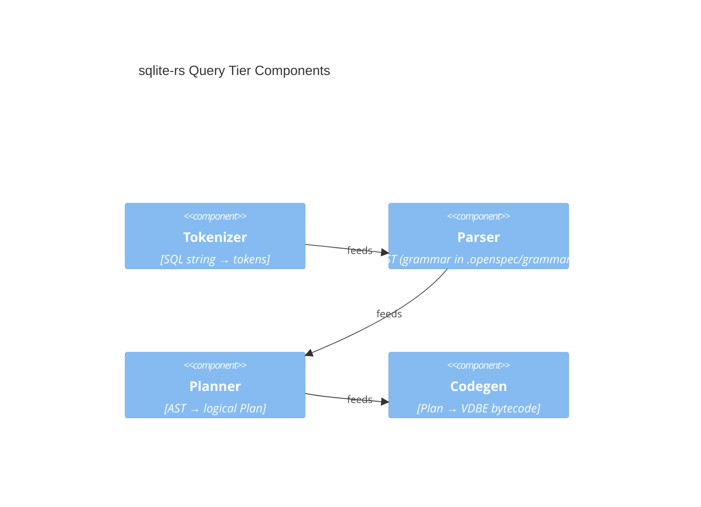

# Component View

Zooming into the Tier 2 (Query) container from the [container view](c4-container.md):

Module-level detail for each component lives with its spec under
`.openspec/specs/002-parser` and `.openspec/specs/009-vdbe-codegen`.
