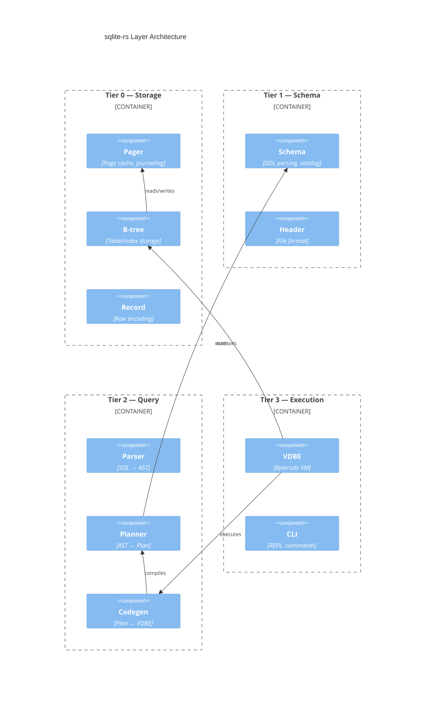

# Container View (Tiering)

```mermaid
C4Container
    title sqlite-rs Layer Architecture

    Container_Boundary(tier0, "Tier 0 — Storage") {
        Component(pager, "Pager", "Page cache, journaling")
        Component(btree, "B-tree", "Table/index storage")
        Component(record, "Record", "Row encoding")
    }

    Container_Boundary(tier1, "Tier 1 — Schema") {
        Component(schema, "Schema", "DDL parsing, catalog")
        Component(header, "Header", "File format")
    }

    Container_Boundary(tier2, "Tier 2 — Query") {
        Component(parser, "Parser", "SQL → AST")
        Component(planner, "Planner", "AST → Plan")
        Component(codegen, "Codegen", "Plan → VDBE")
    }

    Container_Boundary(tier3, "Tier 3 — Execution") {
        Component(vdbe, "VDBE", "Bytecode VM")
        Component(cli, "CLI", "REPL, commands")
    }

    Rel(vdbe, codegen, "executes")
    Rel(codegen, planner, "compiles")
    Rel(planner, schema, "reads")
    Rel(vdbe, btree, "accesses")
    Rel(btree, pager, "reads/writes")
```

See [Tiering](tiering.md) for what each tier guarantees.
