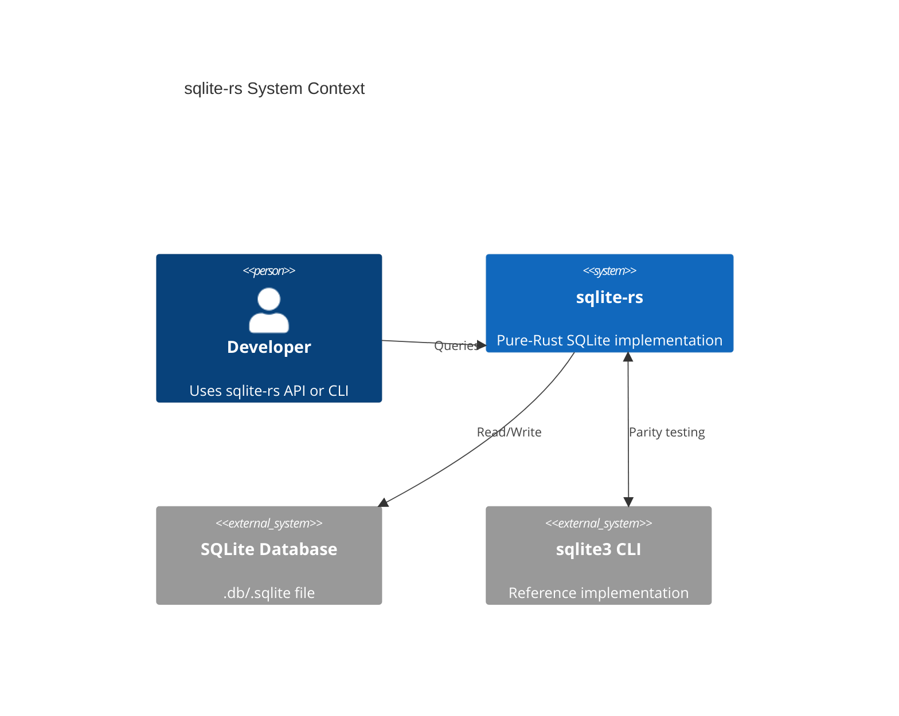

# System Context

`sqlite-rs` reads and writes the same on-disk file format as the reference
`sqlite3` implementation, and is validated against it via oracle-diff parity
tests (see `.openspec/specs/004-corpus`).
