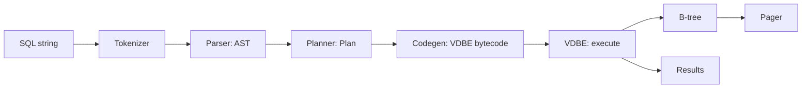
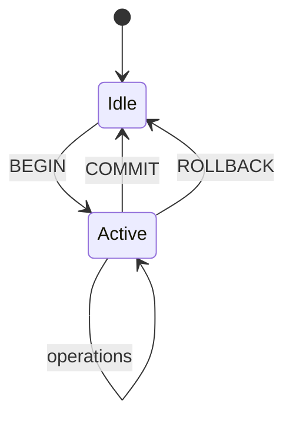
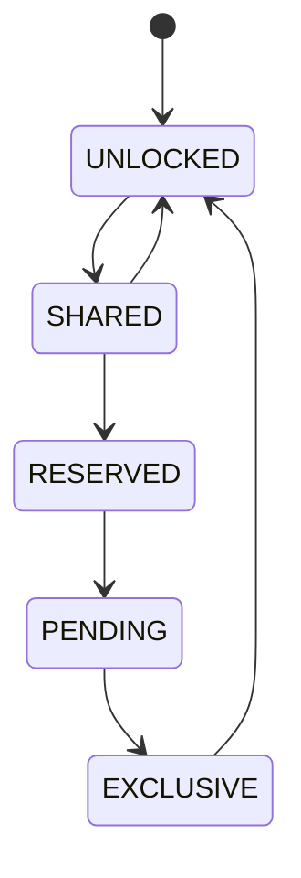

# Query Execution Flow

```mermaid
flowchart LR
    A[SQL string] --> B[Tokenizer]
    B --> C[Parser: AST]
    C --> D[Planner: Plan]
    D --> E[Codegen: VDBE bytecode]
    E --> F[VDBE: execute]
    F --> G[B-tree]
    G --> H[Pager]
    F --> I[Results]
```

## Transaction lifecycle

```mermaid
stateDiagram-v2
    [*] --> Idle
    Idle --> Active: BEGIN
    Active --> Active: operations
    Active --> Idle: COMMIT
    Active --> Idle: ROLLBACK
```

## Locking protocol

```mermaid
stateDiagram-v2
    [*] --> UNLOCKED
    UNLOCKED --> SHARED
    SHARED --> RESERVED
    RESERVED --> PENDING
    PENDING --> EXCLUSIVE
    EXCLUSIVE --> UNLOCKED
    SHARED --> UNLOCKED
```
